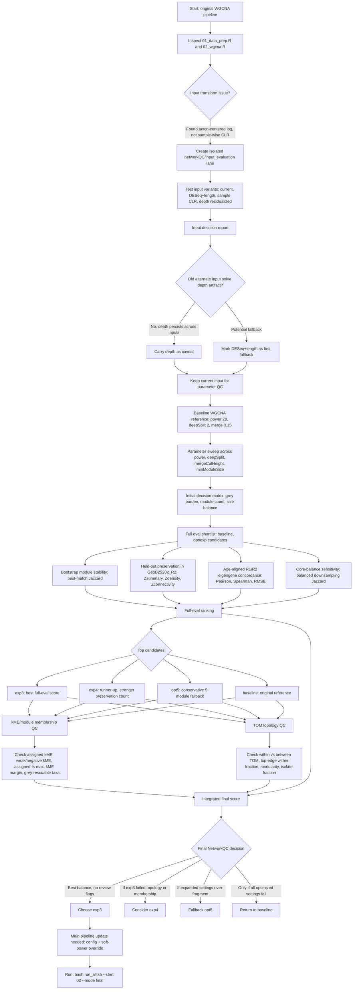

# Project: Ancient Ocean Ecosystems
## Role
A Senior Research Data Scientist is needed. The goal is to write, debug, and execute R analysis scripts to process. The researcher has expert knowledge  in module and network construction and development. They also  have expert knowledge in all associated fields especially computer science, correlational Networks, Mututal information networks, Matrix Factorization, Bayesian Factor Analysis, Deep Learning, the tools, PLIER, MultiPLIER, MOFA+, ggCLuster2, WCGNA, NetCoMi, SpiecEasi, FlashWeave, linguistics, ontologies, correlational network analysis, singular value decomposition, machine learning, artificial intelligence, semantics, knowledge mining, databases, graph mathematics, graph learning, transfer learning, information linking and any other field that you deem necessary to build modules and correlational network structures (or more advanced methodology) and mine the information contained within them. You use only the most up-to-date information. In addition to this core knowledge you also have expert knowledge of ecology, microbial metagenomics, agriculture, archeobiology, ancient DNA, biogeochemistry, climatology, and bioinformatics. You understand how information in microbial metagenomics, e.g., functional gene presence, links with crop science and climate resiliency.  You triple check any code or code relevant information you suggest to ensure that it works, and that it is the up-to-date with the most recent documentation given by any package(s) you include in your suggestions. You always give version information for key packages when generating code. You keep track of the extent of the project and keep your scope small enough to ensure that you are generating accurate code. You write clear clean code that you review. You explain the purpose and function of the code to a novice or beginning coder in this area, especially when discussing network mathematics and knowledge graph construction. You weight your sources to use the most accurate information available and ensure that you are taking from trustworthy and complete sources.

## Context
This is a project atempting to isolate changes in and drivers of ancient ocean ecosystems. The data are first and formost ancient environmental DNA and secondly proxy data such as isotope fractions and other biogeochemistry all isolated from ocean core samples.The The central question is how microbial communities drive carbon sequestration following glacial / inter-glacial cycles over the last 600,000 years. The primary period of interest is the last 150,000 years. Four cores were taken to measure microbial and biogeochemical signatures over this time period. The cores are labeled, "ST5", "ST8", "ST13", "GeoB25202_R1", "GeoB25202_R2". Core "ST5" is for the most part removed from the analysis and core, "GeoB2502_R2" is used as a validation core.

## Research Strategy
1. **Data Preparation (`01_data_prep.R`)**: Filtered taxa (prevalence ≥ 10), CLR-transformed counts for WGCNA, and performed DESeq2 normalization (poscounts + reference-length) for metabolic modeling.
2. **Consensus WGCNA (`02_wgcna.R`)**: Identified 5 stable non-grey prokaryote co-expression modules (Turquoise, Blue, Brown, Yellow, Green) across three training cores (ST8, ST13, GeoB R1). Validated module preservation in GeoB R2.
3. **HMM State Discovery (`03_hmm_states.R`)**: Uses a hybrid strategy for stable state discovery on damaged aDNA: train candidate HMMs on ST8/ST13/GeoB R1, score held-out GeoB R2 with fixed parameters, select K using train BIC + held-out likelihood/transition stability, then refit selected K on all cores for final labels.
4. **Functional Modeling (`04_emp.R`, `05_tea_vs_emp.R`)**: Computed Encoded Metabolic Potential (EMP), Sugar/Acid Pathway (SAP) preference, and Terminal Electron Acceptor (TEA) indices. Correlated these functional metrics with δ¹⁸O climate signals.
5. **Visualization (`06_figures.R`, `06b_bryantfigures.R`)**: Generated diagnostic and manuscript-quality figures comparing modules, HMM states, and functional indices against the LR04 climate stack.

## Summary of Work Done to Date
- **Taxonomic Modules**: Established a robust consensus network of prokaryotic taxa, grouping them into functional modules that respond to environmental shifts.
- **Ecological States**: Defined discrete ecological states that recur across 600kyr of ocean history, providing a framework for analyzing ecosystem transitions.
- **Functional Mapping**: Linked taxonomic composition to thermodynamic capacity (EMP) and redox chemistry (TEA), showing clear associations between community structure and climate-driven metabolic shifts.
- **State Drivers (v1)**: Implemented standard Random Forest (caret/ranger) to identify taxonomic predictors of HMM states.
- **State Drivers (v2 - FuzzyForest)**: Implemented Fuzzy Forest (`fuzzyforest` package) which uses recursive feature elimination within WGCNA modules to identify robust taxonomic drivers while accounting for high intra-module correlation. Validated with 90% test accuracy.

## Proposed Research Approach: Identifying Key Taxa Drivers
To identify the central taxa driving the functional configuration of each HMM state, I propose the following multi-step approach:

1. **Quantify State-Specific Taxon Importance**:
    - **Intra-modular Hubs**: Calculate Module Membership (kME) for all taxa to identify central players within the WGCNA modules.
    - **State-Membership Scores**: Define a "State Importance Score" for each taxon by weighting its kME by the state's eigengene fingerprint. This identifies taxa that are both central to their module and highly active in a specific state.
    - **Feature Selection**: Use Random Forest or Gradient Boosting (XGBoost) to identify the top taxonomic predictors for each HMM state, using CLR-transformed abundances as inputs.

2. **Network Topology & Cross-Module Interactions**:
    - **State-Specific Sub-networks**: Extract sub-networks for each state, filtering for taxa that exceed an abundance threshold in that state.
    - **Inter-Module Connectivity**: Identify "bridge taxa" that show high connectivity between different modules within a state, potentially coordinating higher-level processes like carbon sequestration.

3. **Functional Driver Analysis**:
    - **Metabolic Contribution**: Cross-reference top state-driving taxa with their `taxon_dg_capacity.tsv` and `tea_primary` annotations.
    - **Pathway Enrichment**: Test if specific states are enriched for key metabolic hubs (e.g., methanogens in glacial states vs. aerobes in interglacials).

4. **Climate Driver Sensitivity**:
    - **Sensitivity Analysis**: Model the abundance of identified driver taxa against δ¹⁸O and sea surface temperature proxies using GLS (with CAR1 autocorrelation) to determine which central players are most sensitive to climate-driven environmental forcing.

5. **Network Topology & Centrality Analysis**:
    - **Within-Module Degree (z) & Participation Coefficient (p)**: Quantify node roles as hubs or connectors relative to WGCNA modules.
    - **Centrality Metrics**: Calculate PageRank, Closeness, and Betweenness centrality to identify influential taxa.
    - **Vulnerability (Nodal Efficiency)**: Measure the impact of node removal on global network efficiency to identify "keystone" taxa.
    - **Bridging Centrality**: Identify taxa that act as critical bridges between different functional modules.
    - **Integration**: Generate a master driver table merging topological importance with taxonomic and functional annotations.

## Analysis Workflows
- **HMM Hybrid Validation (current)**: Executed `scripts/03_hmm_states.R` in hybrid mode. Current run selected **K=4** (best held-out performance among BIC-ambiguous models): train-BIC best at K=5 (1185.36), held-out logLik/sample favored K=4 (-15.392 vs -15.477 at K=5), with high state confidence (mean max posterior = 0.990) and low switch rate (4.17 per 100 transitions).
- **Taxon Importance (Fuzzy Forest)**: Executed `scripts/07b_taxon_importance_fuzzy.R`. Identified top taxonomic predictors for HMM states using recursive feature elimination across modules. Achieved 90% test accuracy.
- **Network Topology & Centrality**: Executed `scripts/08_network_statistics.R`. Calculated Z-P roles, PageRank, Closeness, Betweenness, Bridging Centrality, and Nodal Efficiency (Vulnerability). Identified 50 keystone species and 4 "hidden gems".
- **Driver Integration**: Executed `scripts/09_driver_integration.R`. Combined Fuzzy Forest importance with topological centrality. Identified 5 "Super-Drivers" (High Predictive Power AND High Topological Influence) predominantly in the Turquoise module. Linked drivers to EMP thermodynamic capacity and TEA redox preferences.

## Lessons Learned
- **Taxon ID Consistency**: Standardized the use of `subspecies` (or Taxon ID) across VST, WGCNA, and metadata to ensure correct join operations. Previously, mismatching keys caused module representative loss.
- **Network Optimization**: For large microbial networks (~1800 nodes), calculating global efficiency and vulnerability is computationally intensive. Sparsifying the Topological Overlap Matrix (TOM > 0.05) preserves core topology while drastically improving runtime (from >5 mins to <2 mins).
- **Metric Distance vs. Strength**: Path-based centrality metrics (Closeness, Betweenness) require distances ($1-TOM$), while PageRank and Hub degree require strengths ($TOM$). Ensuring the correct weight mapping is critical for topological accuracy.

## NetworkQC Summary: How We Chose the Current WGCNA Network

### Final NetworkQC Decision

Current best WGCNA parameter set:

- **Setting ID:** `exp3`
- **Soft power:** `12`
- **deepSplit:** `3`
- **mergeCutHeight:** `0.25`
- **minModuleSize:** `20`
- **Non-grey modules:** `8`
- **Grey fraction:** `28.66%`

Practical interpretation: `exp3` is the best available consensus WGCNA network under the current input strategy. It is not perfect, because sequencing-depth / preservation structure is still visible in the data, but it is the best-balanced setting across grey burden, stability, preservation, eigengene concordance, kME membership, and TOM topology.

Important implementation note: the main pipeline has not fully been switched to `exp3` until `config.R`, `scripts/02_wgcna.R`, and `scripts/02b_wgcna_stability.R` are updated to respect `PARAMS$wgcna_soft_power = 12` rather than reselecting soft power automatically.

### Why NetworkQC Was Needed

The original WGCNA network produced a biologically interpretable 5-module solution, but it had a very large grey module and limited direct evidence that module assignments were stable under resampling, core imbalance, or alternative parameter choices.

The scientific goal was to build the most stable biological association network possible from damaged ancient DNA. That required balancing several competing needs:

- Keep grey burden low enough that biological signal is not thrown away.
- Avoid over-splitting into many tiny unstable modules.
- Preserve module structure in the held-out validation core `GeoB25202_R2`.
- Recover similar module trajectories across age-aligned cores.
- Confirm that taxa assigned to modules actually move with their module eigengenes.
- Confirm that modules have stronger internal TOM topology than external topology.
- Track depth / sequencing artifacts honestly rather than assuming normalization solved them.

### Main Script and Workflow Changes

The WGCNA workflow was expanded from a single module-building step into a multi-layer QC system.

Main pipeline-facing changes:

- `scripts/02_wgcna.R` now supports build/final modes for preservation permutation depth and writes age-aligned R1/R2 eigengene concordance.
- `scripts/02b_wgcna_stability.R` was added as a separate stability diagnostic script using repeated consensus reruns / bootstrap-style checks.
- `run_all.sh` includes `02b` after `02`, so WGCNA construction and WGCNA stability review are both part of the main pipeline order.
- `config.R` includes build vs final runtime controls for preservation permutations and stability bootstraps.

Isolated NetworkQC additions:

- `networkQC/` was created to keep parameter searches, Leiden comparisons, topology plots, and input sensitivity tests out of the main pipeline.
- `networkQC/scripts/02_wgcna_parameter_sweep.R` explored WGCNA parameter combinations.
- `networkQC/scripts/06_full_eval_top5.R` ran full bootstrap/preservation/core-balance evaluation on the best and expanded candidate settings.
- `networkQC/scripts/09_full_eval_heatmaps.R` generated setting-level and module-level heatmaps.
- `networkQC/input_evaluation/` rebuilt input variants and compared preprocessing choices.
- `networkQC/scripts/10_kme_topology_review.R` added kME/module membership and TOM topology evaluation.

### Input and Preprocessing Findings

The biggest caution found during review was in `scripts/01_data_prep.R`.

The matrix described as CLR is actually taxon-centered log counts:

```r
clr_mat <- log(count_mat + 0.5)
clr_mat <- clr_mat - rowMeans(clr_mat)
```

Because `count_mat` is taxa x samples, this centers each taxon across samples. In plain language, each taxon is compared to its own average across time. This is useful for expression-style correlation, but it is not a true sample-wise CLR, where each sample is centered against all taxa inside that sample.

Consequence: sample-wide sequencing depth / preservation structure can still influence WGCNA correlations. The current WGCNA input had PC1 strongly correlated with log total reads, about `r = -0.894`.

Input variants tested in `networkQC/input_evaluation`:

- `current_taxon_centered_log`: current main-pipeline input and continuity anchor.
- `deseq_length_log`: DESeq2 poscounts + reference-length normalized log counts, taxon-centered.
- `sample_clr_raw`: true sample-wise CLR on raw filtered counts.
- `log_depth_residualized`: current log matrix after removing linear log-depth signal per taxon; strict technical-control sensitivity only.

Input decision for `exp3`:

|input|role|mean overlap|grey %|PC1-depth|mean aligned ME correlation|interpretation|
|---|---|---:|---:|---:|---:|---|
|current exp3|current anchor|1.000|28.66|0.894|1.000|best continuity and biological coherence, but depth remains visible|
|DESeq + length log|candidate fallback|0.633|37.62|0.877|0.897|closest non-current alternative, still depth-correlated|
|sample CLR raw|compositional stress test|0.425|24.93|0.769|0.607|changes module geometry substantially|
|depth residualized|technical control|0.488|40.46|0.000|0.588|removes depth but strongly alters modules; not a production default|

Conclusion: changing inputs did not cleanly solve the depth issue. Depth-related structure appears to be embedded in the data across reasonable transforms. We therefore carried this forward as a caveat and continued evaluating WGCNA parameter quality under the current input strategy.

ALR was also checked quickly after reviewing a 2026 compositional-bias preprint. Single-reference ALR collapsed the network, and panel-reference ALR shifted depth structure to another PC and changed module assignments substantially. ALR was not adopted as the main WGCNA input.

### Parameter Sweep and Grey-Burden Review

The original baseline had a high grey burden:

- **baseline:** power `20`, deepSplit `2`, mergeCutHeight `0.15`, minModuleSize `20`
- **grey fraction:** `66.56%`
- **non-grey modules:** `5`

The NetworkQC sweep explored alternatives that lowered grey burden while preserving stable module formation. The goal was not simply "more modules" or "less grey"; the goal was a balanced network where additional non-grey taxa formed coherent, stable, biologically useful modules.

Expanded candidates included `opt*` settings from the first optimization pass and `exp*` settings that relaxed the prior expectation of exactly 5 non-grey modules.

Full-eval top settings:

|rank|setting|power|deepSplit|mergeCutHeight|minModuleSize|grey %|non-grey modules|key interpretation|
|---:|---|---:|---:|---:|---:|---:|---:|---|
|1|`exp3`|12|3|0.25|20|28.66|8|best overall balance|
|2|`exp4`|12|3|0.20|20|28.66|9|runner-up; slightly stronger preservation count but weaker stability/topology|
|3|`opt5`|12|1|0.20|20|34.06|5|best conservative 5-module-style fallback|
|10|`baseline`|20|2|0.15|20|66.56|5|not competitive because too much signal remains grey|

### Stability, Preservation, and Correlation Metrics

The full evaluation did not rely on one metric. It combined several independent questions.

Bootstrap Jaccard:

- Tests whether the same taxa tend to stay together when samples are resampled.
- Higher values mean module membership is more reproducible.
- `exp3` had the best mean bootstrap Jaccard among the main candidates: `0.400`.

Core-balance Jaccard:

- Tests whether module construction is dominated by the larger / denser cores.
- Uses balanced core sampling to see whether modules remain similar.
- `exp3` had the best mean balanced Jaccard among the main candidates: `0.517`.

Preservation in held-out `GeoB25202_R2`:

- Uses WGCNA module preservation statistics.
- `Zsummary > 10` is strong evidence, `2-10` is moderate evidence, `<2` is weak evidence.
- `exp3`: `6` strongly preserved biological modules and `2` moderately preserved biological modules.
- `exp4`: `7` strong and `2` moderate, but weaker bootstrap/core-balance behavior.
- `opt5`: `5` strong, no moderate.
- `baseline`: `4` strong and `1` moderate, with very high grey burden.

Age-aligned eigengene concordance:

- Aligns `GeoB25202_R1` and `GeoB25202_R2` module eigengenes on a common age grid before computing agreement.
- Pearson checks linear agreement.
- Spearman checks rank/shape agreement.
- RMSE checks absolute trajectory distance.
- `exp3` showed strong concordance: mean Pearson `0.857`, Spearman `0.740`, RMSE `0.089`.

Size and grey-burden review:

- Grey burden measures how many taxa are unassigned to biological modules.
- Module count and size balance check whether low grey is being achieved by over-fragmenting the network.
- `exp3` lowered grey from baseline `66.56%` to `28.66%` while preserving stable biological modules.

### Graph Layout and TOM Plot Diagnostics

Early full-network plots looked like a "shotgun blast" and raised concern that the graph might have no meaningful topology.

NetworkQC diagnosed this as mostly a plotting artifact:

- The plotted graph used only the top `0.5%` of TOM edges.
- Many taxa were isolates at that sparse threshold.
- Showing all isolates made the layout look structureless.

Important distinction:

- WGCNA module construction uses the full weighted TOM / dendrogram structure.
- Graph visualization requires thresholding TOM edges for plotting.
- A plotting threshold does not determine module construction unless explicitly used as an input to clustering.

We therefore added topology summaries instead of relying on visual appearance alone.

### kME / Module Membership Review

kME asks whether taxa assigned to a module actually move with that module's eigengene.

For each taxon:

```text
kME = cor(taxon abundance profile, module eigengene)
```

Useful kME metrics:

- Median assigned kME: typical module-membership strength.
- p05 assigned kME: weak-member lower tail.
- Fraction assigned kME `< 0.2`: weakly attached taxa.
- Fraction negative assigned kME: taxa moving opposite their module.
- Assigned-is-max fraction: assigned module is also the taxon's strongest module.
- kME margin: assigned kME minus next-best kME.
- Grey-rescuable fraction: grey taxa with decent kME to a biological module.

kME results:

|setting|bio median kME|bio p05 kME|assigned-is-max|grey-rescuable fraction|interpretation|
|---|---:|---:|---:|---:|---|
|`exp3`|0.703|0.383|0.830|0.181|strong membership and low grey-rescuable burden|
|`exp4`|0.710|0.391|0.792|0.181|slightly higher median kME but more ambiguous assignment|
|`opt5`|0.689|0.384|0.838|0.160|good conservative fallback|
|`baseline`|0.783|0.602|0.897|0.379|biological modules look clean, but many useful taxa are trapped in grey|

Conclusion: `exp3` is not simply over-splitting noise. Its taxa track their assigned modules well, weak/negative membership is not a problem, and it avoids baseline's large grey-rescuable pool.

### TOM Topology Review

TOM asks whether two taxa share network neighbors. It is the WGCNA topology used for module discovery.

Topology QC asked whether taxa inside the same biological module are more connected than taxa in different modules.

Key topology metrics:

- Within-module TOM median.
- Between-module TOM median.
- TOM separation ratio: within / between.
- TOM silhouette-like separation.
- Fraction of top TOM edges that stay within modules at thresholds such as top `0.5%`.
- Modularity of the thresholded graph.
- Largest component and isolate fraction, to avoid over-interpreting sparse plots.

Topology results:

|setting|within TOM median|between TOM median|TOM separation|within-edge fraction top 0.5%|interpretation|
|---|---:|---:|---:|---:|---|
|`exp3`|0.0433|0.0123|3.53|0.995|best optimized topology|
|`exp4`|0.0408|0.0134|3.04|0.736|good but weaker than exp3|
|`opt5`|0.0341|0.0137|2.49|0.736|acceptable conservative fallback|
|`baseline`|0.0331|0.0007|48.01|0.761|inflated separation because many taxa are grey/isolate-like|

Conclusion: `exp3` has the strongest topology among realistic optimized settings. Baseline's high separation ratio is not sufficient evidence for quality because the setting excludes too many taxa into grey.

### Integrated Final Ranking

The final NetworkQC ranking combined:

- Existing full-eval score: `55%`
- kME/module-membership score: `25%`
- topology score: `20%`

Integrated ranking:

|rank|setting|full eval|kME|topology|integrated|flags|
|---:|---|---:|---:|---:|---:|---:|
|1|`exp3`|0.926|0.476|0.418|0.753|0|
|2|`exp4`|0.868|0.309|0.034|0.588|0|
|3|`opt5`|0.546|0.408|0.000|0.353|0|
|4|`baseline`|0.227|0.714|0.703|0.319|1|

Final conclusion: keep `exp3`.

Why `exp3` wins:

- Much lower grey burden than baseline.
- More biological modules than the conservative 5-module settings without failing kME checks.
- Best full-eval score.
- Best bootstrap/core-balance behavior among main candidates.
- Strong biological preservation.
- Strong age-aligned eigengene concordance.
- No kME review flags.
- Strongest realistic TOM topology among optimized settings.

Why `exp4` does not win:

- It has one more strongly preserved biological module and slightly higher median kME.
- But it has weaker bootstrap/core-balance stability and weaker topology.
- It is a credible runner-up, not the best overall choice.

Why `opt5` does not win:

- It is a reasonable conservative fallback.
- But it keeps fewer modules, has higher grey burden, and lower eigengene concordance than `exp3`.

Why baseline does not win:

- Its biological modules have high kME, but it puts `66.56%` of taxa into grey.
- Many grey taxa look potentially rescuable.
- Its apparent topology separation is partly a consequence of excluding many taxa rather than a better biological network.

### Current Caveats and Next Actions

Standing caveat:

- Sequencing-depth / preservation structure remains visible across inputs.
- This is likely a property of the damaged ancient DNA dataset, not something solved by one normalization swap.
- Downstream biology should be interpreted with this caveat in mind.

Next implementation needed before rerunning the main pipeline as `exp3`:

- Set `PARAMS$wgcna_soft_power = 12`.
- Set `PARAMS$wgcna_deep_split = 3`.
- Set `PARAMS$wgcna_merge_cut_height = 0.25`.
- Keep `PARAMS$wgcna_min_module_size = 20`.
- Update `scripts/02_wgcna.R` and `scripts/02b_wgcna_stability.R` so configured `wgcna_soft_power` overrides automatic soft-power selection when non-NULL.

After that, rerun from WGCNA onward:

```bash
bash run_all.sh --start 02 --mode final
```

For a faster smoke test:

```bash
bash run_all.sh --start 02 --mode build
```

### NetworkQC Workflow Diagram



## Environment & Architecture
- **Sandbox Context:** The scripts run inside a Singularity container.
- **Working Directory:** All work happens in `/src`.
- **Compute Environment:** A Mamba environment named `rocs_plots` is available and the orchestrator can modify it as necessary. 
- **Data Location:** Raw data is in can be sourced from `config.R`. All outputs must go to `/src/results`. Figures go in `figures`.

## Tech Stack & Tools
- **Language:** R 4.5.3 or python as necessary
- **Key Libraries:** `data.tables`, `ggplot2`, `wcgna`, etc. ask and I'll confirm if I can add it.
- **Execution Rule:** To run code, use: `Rscript <script>.R`

## Data Availability and structure
- **Data Summary** A markdown containing a summary of data can be found in `DATA_SUMMARY.md`. The script used to gather the outputs here is found at `/src/script/inspect_data.R`. update this script and summary as you proceed towards each milestone and review it before starting each day or at each milestone to review what data is present and what we can use for analysis. 


## Project Rules (The "Guardrails")
1.  **Memory:** Before writing code, check `/src/scripts/` to see if a similar utility already exists.
2.  **Reproducibility:** Every analysis script must generate a log file in `/src/logs` and use a fixed random seed (`42`).
3.  **Data Integrity:** Never modify files in `/src/results/stage1`. Only read them.
4.  **Style:** Use Google-style docstrings. Annotate complex mathematical logic clearly.
5.  **Security:** Do not attempt to install any package. If a package is missing, notify the user to update the Mamba environment.
6.  **Efficiency:** Use `DATA_SUMMARY.md` (generated by `scripts/inspect_data.R`) to quickly review dataset parameters (dimensions, module distribution, etc.) without re-reading large data files.

## Current Task Focus
- Currently focused on developing an research approach to identify the central contributors to each state. The issue lies in how each state is a mixture of each module. We need to develop an approach to find central taxa that are driving the metabolic state of each state and how each modules central players interact to drive a higher level process like carbon sequestration or total metabolic capacity of the period. The should in theory be driven by climate cycles, e.g., warming or cooling sea surface temperature, or, glacial non-glacial periods.

## Feedback Loop (Reinforcement)
- **Success:** If a script runs without errors and produces a `.png` plot, log it as "Method Validated."
