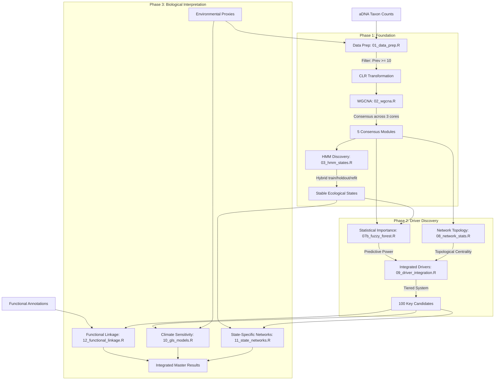

# Analysis Workflow: Ancient Ocean Ecosystem Drivers

This document outlines the end-to-end computational pipeline used to identify keystone microbial drivers and their response to 600,000 years of climate cycles.

## 1. High-Level Research Pipeline

## 2. Detailed Methodology Table

| Phase | Step | Method | Key Parameters/Thresholds | Output |
| :--- | :--- | :--- | :--- | :--- |
| **Foundation** | Data Prep | CLR Transformation | Prevalence ≥ 10 samples | Normalized abundance matrix |
| | Module Const. | Consensus WGCNA | Soft Power: 12; Min Module Size: 20 | 5 Stable Non-grey Modules (Turquoise, Blue, Brown, Yellow, Green) |
| | State Discovery | Hybrid HMM (train/holdout/refit) | Train: ST8/ST13/GeoB R1; Holdout: GeoB25202_R2; Refit on all cores; PCs 1-3 | Current run: 4 Ecological States (G-A, IG-B, IG-C, IG-D) |

## 3. HMM Hybrid Validation Metrics (Current Run)

| Metric | Value |
| :--- | :--- |
| Train-BIC best K | 5 (BIC = 1185.36) |
| Hybrid-selected K | 4 |
| Held-out logLik/sample (K=4) | -15.392 |
| Held-out logLik/sample (K=5) | -15.477 |
| Held-out mean max posterior (K=4) | 0.990 |
| Held-out switches per 100 transitions (K=4) | 4.17 |
| **Discovery** | Stat. Importance | Fuzzy Forest | Recursive Feature Elimination; 90% Acc | Rank of predictive taxa per state |
| | Topo. Influence | Centrality Analysis | TOM Sparse > 0.05; PageRank; Bridging | Z-P Roles (Hubs, Connectors, Peripherals) |
| | Integration | Tiered Scoring | **Tier 1**: Top 10% Stat + Top 10% Topo | Integrated Driver Summary |
| **Synthesis** | Climate Sensitivity | GLS Modeling | corCAR1 (Age/Core); d18O (MIS) | Climate-responsive coefficients (FDR < 0.05) |
| | State Networks | Sub-network Extr. | TOM > 0.10; Inter-module density | Bridge Taxa & Module Coordination Map |
| | Func. Linkage | Trait Mapping | EMP (Metabolic) & TEA (Redox) | Functional Hubs & Redox Bridge analysis |

## 3. Key Summaries for Presentation

### A. The "Peripheral Super-Driver" Paradox
Explain that a taxon doesn't need to be a "local hub" (high degree in its own module) to be a "global driver." Many of our most important taxa are **Connectors** or **Hidden Gems**—they are the critical wiring that holds different functional modules together.

### B. The Glacial "Engine"
One of our key findings is that **Glacial State (G-A)** has significantly higher network connectivity than Interglacial states. This suggests the ecosystem "tightens" its coordination during cold periods, primarily through increased anaerobic "Redox Bridges" (Sulfate Reducers and Methanogens).

### C. Metabolic Resilience
Our analysis shows that microbes with the highest **Encoded Metabolic Potential (EMP)** are specifically favored during Glacial periods. These are the "all-rounders" that provide the ecosystem with stability when environmental conditions are most challenging.

---
*Generated for: Ancient Ocean Ecosystems Project Review*
